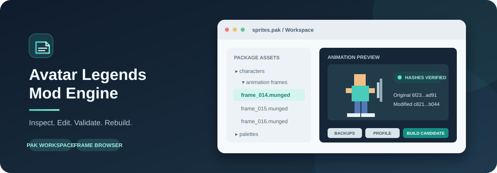

# Avatar Legends Mod Engine



A Windows desktop utility for inspecting Avatar Legends: The Fighting Game `.pak` archives, browsing and replacing MUNGED animation frames, validating edits, rebuilding candidate archives, and saving portable mod profiles.

> **Status: experimental.** Archive inspection and extraction have been checked against the shipped `sprites.pak`. A same-size no-op rebuild preserves the original package byte-for-byte. A behavior-changing mod has not yet been verified in game. Treat rebuilt archives as candidates and keep backups of anything you choose to replace manually.

## Features

- Browse `.pak` files from the game folder or its `data_packages` directory; inspect indexed paths, sizes, and payload offsets.
- Export a package to a separate workspace and write a manifest containing the source package hash and extracted file hashes.
- Preview MUNGED frames as PNG using the external `avatar-legends-tools` decoder.
- Browse recognized characters and motions, play frame sequences, and select one or several frames for replacement.
- Stage edits in a workspace with backups and a change manifest. The installed package is not edited by the GUI.
- Undo and redo staged workspace operations, including frame batches and profile reapplication. `Ctrl+Z` undoes and `Ctrl+Y` redoes; history checks file hashes and stops if a file changed outside the tool.
- Validate the workspace file inventory and hashes, and decode changed MUNGED files before rebuilding.
- Rebuild a candidate `.pak` with the external packer and compare the rebuilt index and every payload hash against the workspace.
- Create portable mod profiles containing a readable JSON description, replacement assets, original payload backups, and SHA-256 hashes. Review a profile against another package and reapply it to that package's workspace.
- Save the location of the external tools folder in `mod_engine.ini` beside the GUI.

## Requirements

- Windows and Python 3.10 or newer.
- The Avatar Legends: The Fighting Game installation, for the game packages you want to inspect.
- The community project [`calebrisc/avatar-legends-tools`](https://github.com/calebrisc/avatar-legends-tools) for MUNGED decoding and package rebuilding. It is **not bundled** with this repository. Follow that project's own setup and license terms.

The basic package index lister/extractor and the one-file same-size replacement command use Python's standard library. The GUI uses Tkinter, which is included in most Windows Python installations. MUNGED preview, MUNGED validation, animation replacement, and workspace rebuilding require the external tools.

## Get started

1. Clone or download this repository.
2. Install Python 3 for Windows. During installation, enable the option that adds Python to `PATH`.
3. Download and set up `avatar-legends-tools` separately, following its upstream instructions.
4. Start the GUI from a PowerShell window in the repository directory:

   ```powershell
   python .\mod_engine_gui.py
   ```

   Or double-click `run_gui.bat`.
5. The GUI opens in English by default. Use the language selector in the upper-right corner to switch between English and Portuguese; the choice is saved in `mod_engine.ini`. Choose the game installation folder with the folder picker, scan for `.pak` files, and select a package.
6. To use MUNGED features, configure the external tools folder by selecting the root folder containing `munged_extract.py` and `pak_pack.py`. The location is saved locally in `mod_engine.ini` and restored at the next launch.

If the tools folder is moved, configure its new location once. The saved INI contains machine-specific settings and should not be committed to Git.

## Typical workflow: edit and rebuild

1. Select a package. Open the animation browser to inspect a character, motion, and frame sequence, or select an indexed file directly.
2. Prepare replacement `.munged` files with the upstream tools. For batch replacement, put the replacements in a folder and match each filename to the corresponding indexed frame name.
3. Use the animation browser batch replacement control or the main window MUNGED replacement control. The GUI validates replacements before staging and stores backups in the package workspace.
4. Use the workspace validation control to check that the workspace contains the expected files and that changed MUNGED frames decode successfully.
5. Use the rebuild control to write a new candidate `.pak`. The GUI validates the result's structure, indexed paths, payload sizes, and payload hashes. Choose an output outside the installed game folder.
6. Keep the candidate, its generated manifest, and the workspace. Runtime loading and compatibility have not been confirmed by this project.

The direct **Replace selected file** action uses the standalone same-size replacement writer; its replacement must match the original payload size. The workspace rebuild path uses the external packer and can handle size changes if that packer supports the particular asset and archive.

Use the **Undo** and **Redo** controls in the Workspace group, or press `Ctrl+Z` and `Ctrl+Y`, to step backward and forward through staged replacements. A batch replacement or profile reapplication is one history step. If a workspace file no longer matches the saved history hash, the operation is refused to avoid overwriting an external edit. History snapshots use additional disk space and are stored beside each workspace.

Undo/redo history begins recording operations from the version that introduced this feature. Older staged changes remain in the workspace, but cannot be undone through this history because their before/after snapshots were not recorded.

## Mod profiles

Profiles are useful for review, archival, or carrying changes to a newer version of a package.

1. Stage edits and select the create mod profile control.
2. The GUI validates the workspace and creates a `.modprofile.json` file plus a sibling folder named `<profile>.assets`.
3. Keep the JSON and `.assets` folder together. The folder contains copies of each replacement and the corresponding original package payload. The JSON records the source package name and SHA-256, changed paths, original/replacement sizes, and hashes.
4. To review or reapply the profile later, first select the destination package in the GUI. For a game update, select the updated `.pak` so the tool extracts and compares that version.
5. Choose the review/reapply profile control. The review window reports package hash differences, paths absent from the destination, and paths whose original asset hashes changed. Confirm reapplication to stage the replacements in the destination package's isolated workspace with backups.
6. Validate that workspace and rebuild a new candidate `.pak`.

A profile does not automatically resolve upstream changes to an asset. A changed base hash is surfaced for review; the replacement is still copied only after explicit confirmation. A path absent from the selected package prevents reapplication.

## Workspace and generated files

The GUI creates these directories beside the application when needed:

- `workspaces/` — extracted package contents, export manifests, change records, backups, and preview/validation scratch files.
- `builds/` — a suggested destination for rebuilt candidate packages and their manifests.
- `profiles/` — the suggested destination for new mod profiles.

Generated files can be large. Keep a copy of any profile's `.assets` folder; it is required to verify or reapply that profile. `mod_engine.ini` stores the local path to the external tools project.

Each package workspace stores `.mod_engine_history.json` and a `.mod_engine_history/` folder containing the undo/redo stacks and before/after snapshots.

## Command-line package utility

List package summaries:

```powershell
python .\pak_probe.py "C:\Games\Avatar Legends The Fighting Game\data_packages\sprites.pak"
```

List all indexed paths and payload ranges:

```powershell
python .\pak_probe.py --list "C:\Games\Avatar Legends The Fighting Game\data_packages\sprites.pak"
```

Extract a package outside the game installation:

```powershell
python .\pak_probe.py --extract .\exports "C:\Games\Avatar Legends The Fighting Game\data_packages\sprites.pak"
```

Create a candidate package with one **same-size** replacement:

```powershell
python .\pak_probe.py "C:\Games\Avatar Legends The Fighting Game\data_packages\sprites.pak" `
  --replace "data/ai/aang.ai" .\exports\sprites\data\ai\aang.ai `
  --output .\builds\sprites-mod.pak
```

The utility checks the observed `PACK` header, index bounds, path safety, payload alignment, payload bounds, and range overlap. Extraction refuses to overwrite existing exports. Replacement writes a new package and a JSON manifest; it does not edit or install the source package. Output paths inside the detected game directory are rejected.

Run `python .\pak_probe.py --help` for the available options.

## How the package format is handled

The observed package format starts with a 12-byte `PACK` header, followed by data payloads and a fixed-width index at the end. Each 256-byte index row contains an ASCII internal path in its first 248 bytes, then a little-endian payload offset and payload size. In the inspected installation, payload offsets are 4096-byte aligned and payload ranges do not overlap.

These observations come from inspecting the installed packages and executable. They describe the packages examined so far; they are not a guarantee for every game version or every archive. See [FINDINGS.md](FINDINGS.md) for evidence and open questions, and [VALIDATION.md](VALIDATION.md) for the checks performed so far.

## Safety and current limitations

- The GUI edits extracted workspaces and writes new candidate packages; it does not install mods or overwrite the game's `.pak` files.
- Keep the original game files intact. If you manually experiment with a candidate, make your own restorable backup and use an offline setup.
- A structurally valid package is not proof that the game will load it or render an edited asset correctly.
- Loose-file override precedence, loading a changed candidate in game, and safe install/restore behavior are still unverified.
- The direct CLI replacement operation supports same-size payloads only. Variable-size repacking is delegated to the external packer.
- `.sprbin` palette rebuilding and compatibility are not implemented in this GUI.
- This repository does not include the game executable, game assets, or the external community tools.

## Project files

- `mod_engine_gui.py` — Tkinter GUI, animation browser, validation, profile review, and candidate-package workflow.
- `localization.py` — English/Portuguese interface translations (English is the default).
- `docs/images/mod-engine-banner.svg` — original vector artwork used at the top of this README.
- `mod_profile.py` — portable profile creation, validation, comparison, and reapplication.
- `workspace_history.py` — hash-checked undo/redo snapshots for staged workspace changes.
- `pak_probe.py` — read-only package parser, bounded extractor, and same-size candidate writer.
- `FINDINGS.md` — reverse-engineering observations and unresolved questions.
- `VALIDATION.md` — record of the structural and hash checks performed.

## Contributing

Bug reports and pull requests are welcome. For archive-format changes, include the game/package version and a reproducible sample that does not redistribute copyrighted game files. Do not commit game packages, extracted game assets, profile asset folders, generated previews, or local tool paths.

## License

This project is licensed under the MIT License. See [LICENSE](LICENSE). The game and `avatar-legends-tools` are separate works with their own rights and license terms.
